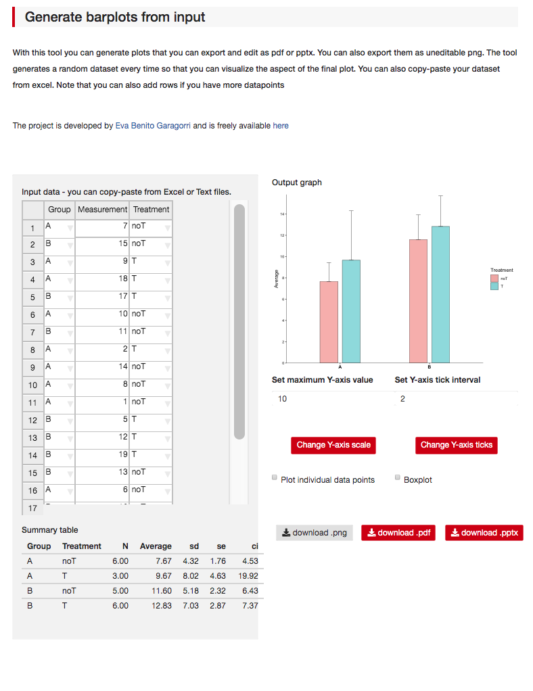

# barPlotSierraLab

A beta version of a shinyApp to plot data as barplots and have it exported as editable pptx, image or vector format.

## Usage

1. Input numerical data into column 'Measurement'
2. Assign groups in column 'Group'
3. [optional] Assign Treatment (or secondary factor) in column 'Treatment'
4. [optional] Choose between plotting averages or individual data points
5. Export graph in desired format

#### Current features: 

- allows **copy-paste from excel**
- **plots live** as you change data
- **individual** bar or **grouped bar** design
- **set** the **Y-axis** by default or manually
- **choose** the Y-Axis **tick mark interval**
- choose to plot **individual datapoints**
- allows **pptx**, **png** and **pdf (vectorial)**. pptx export is vectorial and ungrouppable

#### Known issues (to be fixed):

- The non-numerical data can only be modified *after* the numerical data has been modified
- Not possible to add a column 'on the fly' because of preset column types

#### Fixes/To-do's:

- [x] Fix pptx export 
- [ ] Investigate order of numerica/non-numerical editing options
- [ ] Investigate specifying column types interactively so that adding columns is possible

#### Enhancements:

- [x] Allow svg/eps export
- [x] Allow Setting y-axis scale
- [ ] Add other types of plotting options to same data. 
    - Violin plots
    - Whisker plots
    - others?
- [ ] Optimize automatic setting of Y-scale
- [ ] Prettify website (css)